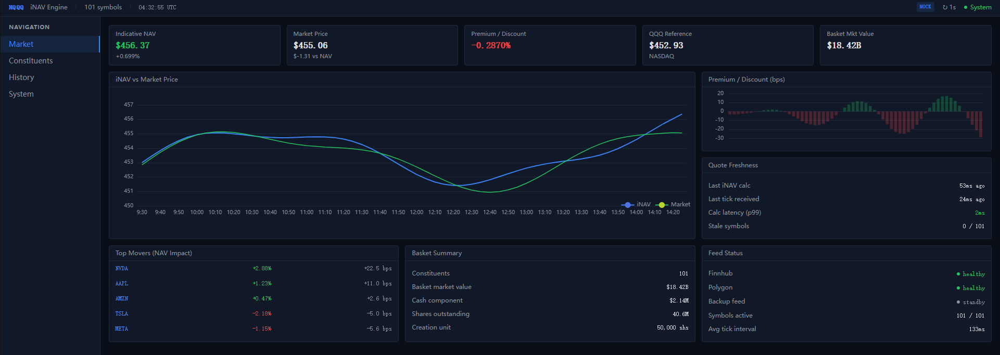
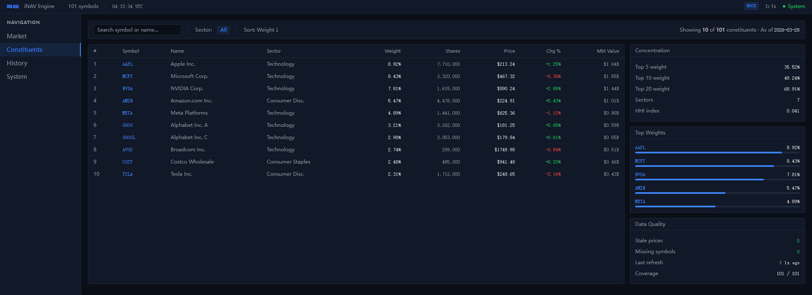
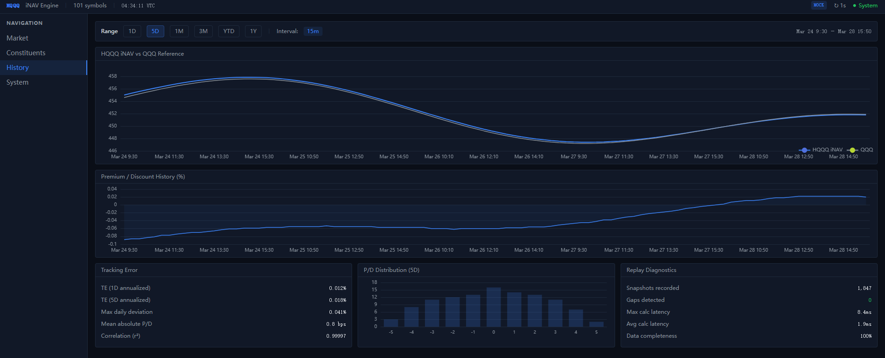
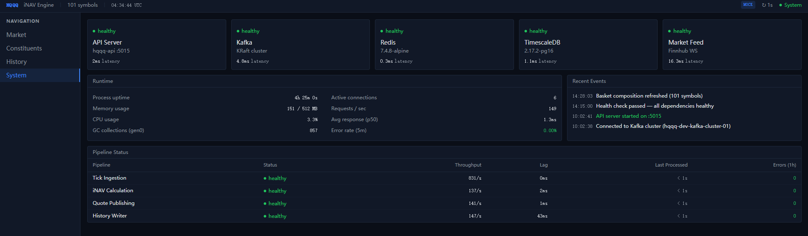

# HQQQ — Nasdaq-100 ETF Engine

Real-time indicative NAV (iNAV) calculation engine for a synthetic Nasdaq-100 ETF.

HQQQ ingests live market data for basket constituents, computes indicative net asset
value with sub-second latency, and streams quote snapshots to a terminal-style UI.

$$iNAV_t = \frac{\sum (P_{i,t} \times Q_i) + \text{Cash}}{\text{Shares Outstanding}}$$

## Repository structure

```
nasdaq-etf-engine/
├── docker-compose.yml              # Local infrastructure stack
├── .env.example                    # Environment variable template
├── docs/
│   └── architecture.md             # Module boundaries and dependency rules
├── infra/
│   └── prometheus/prometheus.yml   # Prometheus scrape config
└── src/
    ├── hqqq-api/                   # ASP.NET Core backend (modular monolith)
    │   ├── Modules/
    │   │   ├── Basket/             # ETF basket composition & reference data
    │   │   ├── MarketData/         # Live constituent price ticks
    │   │   ├── Pricing/            # iNAV / quote snapshot domain
    │   │   └── System/             # Health, readiness, observability
    │   ├── Program.cs
    │   └── Dockerfile
    └── hqqq-ui/                    # React + Vite terminal-style dashboard
        └── src/
            ├── app/                # Router and application root
            ├── components/         # Panel, StatCard, StatusBadge, Chart, etc.
            ├── layout/             # AppShell, TopStatusBar, SidebarNav
            ├── lib/                # Data types, data sourcing hooks
            ├── pages/              # Market, Constituents, History, System
            └── styles/             # Tailwind theme tokens
```

See [docs/architecture.md](docs/architecture.md) for module responsibilities,
frontend page structure, and dependency rules.

## Prerequisites

| Tool           | Version  | Notes                          |
|----------------|----------|--------------------------------|
| .NET SDK       | 8.0      | `dotnet --version`             |
| Node.js        | 22 LTS   | Pinned in `src/hqqq-ui/.nvmrc` |
| npm            | 10.x     | Ships with Node 22             |
| Docker Desktop | Latest   | For local infrastructure       |

## Quick start

### 1. Clone and configure

```bash
git clone https://github.com/<you>/nasdaq-etf-engine.git
cd nasdaq-etf-engine
cp .env.example .env
# Edit .env — set real passwords for local use
```

### 2. Start infrastructure

```bash
docker compose up -d
```

Wait for all services to become healthy:

```bash
docker compose ps
```

### 3. Run the backend

```bash
dotnet watch run --project src/hqqq-api
```

The API starts on **http://localhost:5015**. Swagger UI is available at
[http://localhost:5015/swagger](http://localhost:5015/swagger) in development mode.

### 4. Run the frontend

```bash
cd src/hqqq-ui
npm install
npm run dev
```

The dev server starts on **http://localhost:5173**. API requests to `/api/*` are
proxied to the backend automatically.

## Service URLs

| Service        | URL                          |
|----------------|------------------------------|
| Backend API    | http://localhost:5015         |
| Swagger UI     | http://localhost:5015/swagger |
| Frontend       | http://localhost:5173         |
| PostgreSQL     | localhost:5432               |
| Redis          | localhost:6379               |
| Kafka          | localhost:9092               |
| Kafka UI       | http://localhost:8080         |
| Prometheus     | http://localhost:9090         |
| Grafana        | http://localhost:3000         |

## Frontend pages

| Route            | Page          | Purpose                                        |
|------------------|---------------|-------------------------------------------------|
| `/market`        | Market        | Live iNAV, market price, P/D, movers, freshness |
| `/constituents`  | Constituents  | Holdings table, concentration, data quality      |
| `/history`       | History       | Historical iNAV comparison, tracking error       |
| `/system`        | System        | Service health, runtime metrics, pipeline status |

`/` redirects to `/market`. The frontend uses a persistent shell with a top status
bar (branding, UTC clock, system health) and a left sidebar for navigation.

## Environment variables

See [`.env.example`](.env.example) for the full list. Copy it to `.env` and fill
in real values before running `docker compose up`.

## Pinned versions

Docker image tags are pinned in `docker-compose.yml` to keep local dev deterministic:

| Image                          | Tag            |
|--------------------------------|----------------|
| timescale/timescaledb          | 2.17.2-pg16    |
| redis                          | 7.4.8-alpine   |
| apache/kafka                   | 3.9.0          |
| provectuslabs/kafka-ui         | v0.7.2         |
| prom/prometheus                | v3.1.0         |
| grafana/grafana                | 11.4.0         |

## Shutdown

```bash
docker compose down        # stop containers, keep data
docker compose down -v     # stop containers and remove volumes
```

## Screenshots

### Market — Real-time iNAV command center



### Constituents — Holdings table and basket insights



### History — Historical analytics and tracking error



### System — Service health and pipeline monitoring


