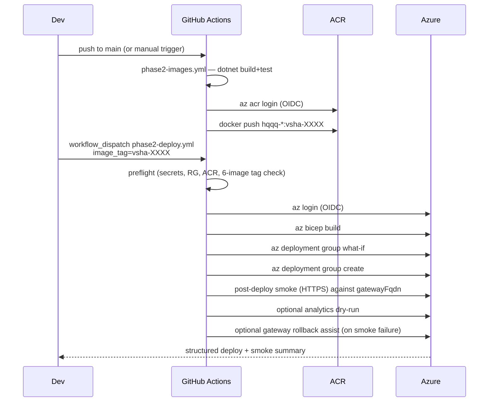

# Phase 2 — Azure deploy walkthrough

This is the **Phase 2 Azure Container Apps surface** listed in the
root [`README.md`](../../README.md) "Current deployment surfaces"
section. It is distinct from the Phase 1 reference demo (the public
live demo links in the README still point at the legacy
`hqqq-api` Web App on Azure App Service, not at this Container Apps
deployment).

Operator-facing companion to
[`infra/azure/README.md`](../../infra/azure/README.md). The README
explains *what* gets provisioned and *how to bootstrap* it; this
document explains *how to use* the resulting workflows day-to-day.

---

## 1) Posture

- **Target**: Azure Container Apps + Azure Container Registry.
- **Out of scope**: AKS / Helm / any Kubernetes manifests.
- **Auth**: GitHub OIDC for both image push and Bicep deploy. No
  long-lived ACR admin credentials in the Phase 2 path. (The
  legacy [`hqqq-api-docker.yml`](../../.github/workflows/hqqq-api-docker.yml)
  workflow keeps using `ACR_USERNAME` / `ACR_PASSWORD` against
  the legacy ACR — intentionally left alone so Phase 1 stays
  demoable while Phase 2 hardens.)
- **External dependencies**: Kafka, Redis, TimescaleDB are assumed
  to already exist somewhere reachable from the Container Apps
  environment. Their connection strings are deploy-time secrets.

---

## 2) Standard workflow loop



---

## 3) Deploying a new revision

1. Merge code to `main` (or run `phase2-images.yml` manually).
2. Wait for `phase2-images.yml` to push tagged images. Note the
   `vsha-...` tag from the run summary, e.g. `vsha-abcdef0`.
3. Run `phase2-deploy.yml` with `image_tag=vsha-abcdef0`. Optional:
   set `what_if_only=true` first for a dry run.
4. Read the run summary for the gateway URL and the smoke
   commands.

The deploy is *idempotent*: running with the same `image_tag`
twice is a no-op for the images, and Bicep only re-applies what
changed. Container Apps creates a new revision when env vars or
the image change.

---

## 4) Running analytics on demand

The analytics job is a `Microsoft.App/jobs` resource with
`triggerType=Manual`. It does not auto-run. To execute a one-shot
report over a specific window:

```bash
RG=rg-hqqq-p2-demo-eus-01
JOB=caj-hqqq-p2-analytics-demo-01

az containerapp job start \
  --name $JOB \
  --resource-group $RG \
  --env-vars \
    Analytics__StartUtc=2026-04-17T00:00:00Z \
    Analytics__EndUtc=2026-04-18T00:00:00Z

# Tail the most recent execution
EXEC=$(az containerapp job execution list -n $JOB -g $RG --query '[0].name' -o tsv)
az containerapp job logs show -n $JOB -g $RG --execution $EXEC --container $JOB --follow
```

Posture (set in [`main.bicep`](../../infra/azure/main.bicep)):

- `replicaTimeout` = 1800 s (30 min) — overridable per environment.
- `replicaRetryLimit` = 1.
- `parallelism` = 1, `replicaCompletionCount` = 1.
- Exit codes: `0` success (incl. empty window), `1` failure, `2`
  unsupported `Analytics:Mode`. The job marks the execution failed
  on non-zero exit.

---

## 5) Container hardening summary

| Concern              | Where it lives                                             |
| -------------------- | ---------------------------------------------------------- |
| Explicit image tag   | `imageTag` Bicep param; never empty. Pin to `vsha-...`.    |
| Health probes        | `/healthz/live` + `/healthz/ready` on the targetPort, configured per app in [`modules/containerApp.bicep`](../../infra/azure/modules/containerApp.bicep). |
| Env var validation   | Existing `IValidateOptions` registrations in each service — e.g. `AnalyticsOptionsValidator` fail-fasts on missing window. |
| Resource limits      | Per-app `cpu` / `memory` Bicep params, defaults documented in [`infra/azure/README.md`](../../infra/azure/README.md). |
| No public debug port | Workers use `ingress.external=false`; the only externally-reachable app is the gateway on :8080. The management host on :8081 is internal-only. |
| Image pull           | User-assigned MI + `AcrPull`. ACR `adminUserEnabled=false`. |
| Secrets handling     | `@secure()` Bicep params -> Container App `secrets` -> `secretRef` env vars. Never plaintext on the template body. |

The Phase 2 service Dockerfiles already run as a non-root `app`
user (uid 10001) and use pinned `mcr.microsoft.com/dotnet/aspnet:10.0`
base images — no Dockerfile changes required in D4.

---

## 6) Adding a second environment

Phase 2 IaC is fully parameterized. Adding e.g. a `prod` boundary:

1. Copy `infra/azure/params/main.demo.bicepparam` to
   `main.prod.bicepparam` and rename every resource (e.g.
   `acrhqqqp2prod01`, `cae-hqqq-p2-prod-eus-01`, ...).
2. Create the prod RG: `az group create -n rg-hqqq-p2-prod-eus-01 -l eastus`.
3. Add a new federated credential for the new GitHub Environment
   (e.g. `phase2-prod`) and grant Contributor on the new RG.
4. Create GitHub Environment `phase2-prod` with its own connection-string secrets and (optionally) approval reviewers.
5. Run `phase2-deploy.yml` with
   `bicep_param_file=infra/azure/params/main.prod.bicepparam`.

No Bicep template changes required.

---

## 7) What the workflow validates automatically vs. what stays manual

The `phase2-deploy.yml` pipeline now enforces a release-hardening gate.
Be honest about what it covers and what it does not:

**Automated (workflow-enforced):**

- Required GitHub repo + environment secrets are present and non-empty.
- Bicep param file exists on disk.
- Resource group exists.
- ACR exists and is reachable.
- Requested `image_tag` is published in ACR for **all six** Phase 2
  images (one aggregated error if any are missing).
- `az bicep build` + `az deployment group what-if` + `az deployment
  group create`.
- Structured deployment summary (deployment name, image tag, RG,
  Container Apps env, gateway app + FQDN, gateway latest revision,
  analytics job).
- Post-deploy gateway smoke: `/healthz/live`, `/healthz/ready`,
  `/api/system/health` with `sourceMode=="aggregated"` assertion (so a
  silent fall-back to the legacy/stub adapter is caught), `/api/quote`,
  `/api/constituents`, `/api/history?range=1D` with JSON-shape
  assertion.
- Optional analytics dry-run over a tight one-hour window (when
  `run_analytics_smoke=true`).
- Optional gateway-only revision rollback assist (when
  `rollback_on_smoke_failure=true`).

**Still manual (after this step):**

- Live SignalR fan-out validation (use `replica-smoke.{ps1,sh}` or any
  minimal SignalR client against `wss://<gatewayFqdn>/hubs/market`).
- Confirming `/api/quote` and `/api/constituents` are returning live
  data (HTTP 200 with non-empty payload), not just the documented cold-start
  `503 quote_unavailable` / `503 constituents_unavailable`.
- External-infra reachability validation (Kafka topics present, Redis
  reachable, TimescaleDB reachable from the Container Apps environment).
- Multi-environment promotion (e.g. demo → prod) — currently a
  bicepparam swap done by hand.
- Custom domain + TLS binding on the gateway external ingress.

**"Safe to demo" =** preflight + deploy + smoke jobs all green on the
target `image_tag`.

**"Safe to promote beyond demo"** still additionally requires the
manual checks above plus a successful analytics dry-run against a
real, populated window.

---

## 8) Event Hubs Kafka — workflow-injected SASL auth

Pointing the Phase 2 services at an Azure Event Hubs Kafka namespace
is now a deploy-time concern, not a manual `az containerapp update`
step. The four SASL values are passed as `@secure()` Bicep params
from `phase2-deploy.yml` into [`main.bicep`](../../infra/azure/main.bicep)
and surfaced into every Kafka-touching app via per-secret
`secretRef` env vars in [`modules/containerApp.bicep`](../../infra/azure/modules/containerApp.bicep).

Apps that receive these env vars: `hqqq-reference-data`,
`hqqq-ingress`, `hqqq-quote-engine`, `hqqq-persistence`. Gateway and
analytics are deliberately excluded (no Kafka client usage).

| GitHub environment secret (`phase2-demo`) | Bicep `@secure()` param   | Container App env var       | Example value (Event Hubs) |
|-------------------------------------------|---------------------------|-----------------------------|----------------------------|
| `KAFKA_BOOTSTRAP_SERVERS`                 | `kafkaBootstrapServers`   | `Kafka__BootstrapServers`   | `<namespace>.servicebus.windows.net:9093` |
| `KAFKA_SECURITY_PROTOCOL`                 | `kafkaSecurityProtocol`   | `Kafka__SecurityProtocol`   | `SaslSsl` |
| `KAFKA_SASL_MECHANISM`                    | `kafkaSaslMechanism`      | `Kafka__SaslMechanism`      | `Plain` |
| `KAFKA_SASL_USERNAME`                     | `kafkaSaslUsername`       | `Kafka__SaslUsername`       | `$ConnectionString` (literal) |
| `KAFKA_SASL_PASSWORD`                     | `kafkaSaslPassword`       | `Kafka__SaslPassword`       | `Endpoint=sb://<namespace>.servicebus.windows.net/;SharedAccessKeyName=...;SharedAccessKey=...` |

All five are enforced by the `phase2-deploy.yml` preflight: an empty
or missing value short-circuits the run with an aggregated error
listing every gap. Values are never echoed to logs and are surfaced
to the container only as `secretRef` references against per-secret
Container App secrets (kebab-case names like `kafka-sasl-password`),
so they never appear inline in the Bicep template body or deployment
history.

`Kafka__EnableTopicBootstrap=false` is **not** wired through the
deploy template (it is a non-secret static toggle): set it via
`appsettings.json` / non-secret env override per environment if the
broker rejects topic creation. Pre-create every topic in
[`docs/phase2/topics.md`](topics.md) on the namespace before
deploying — Event Hubs Kafka does not honour the `CreateTopics`
admin API.

To rotate any of the SASL values: update the corresponding secret
under GitHub Environments → `phase2-demo`, then re-run
`phase2-deploy.yml` against the current `image_tag`. Container Apps
materialises a new revision when secret values change.

Local `docker-compose.phase2.yml` is unaffected — it stays on
plaintext `kafka:29092` (`Kafka__SecurityProtocol` defaults to empty,
which `KafkaConfigBuilder.ApplySecurity` interprets as "skip
security configuration").

---

## 8a) Required GitHub Secrets / Variables for Azure deployment

Authoritative list for the `phase2-deploy.yml` workflow. Anything
marked **required** is enforced by the preflight job — the workflow
fails fast (with one aggregated error) if any are missing or empty.

**Repository secrets (required):**

- `AZURE_CLIENT_ID` — federated credential for OIDC.
- `AZURE_TENANT_ID`
- `AZURE_SUBSCRIPTION_ID`

**Environment `phase2-demo` secrets (required):**

- `KAFKA_BOOTSTRAP_SERVERS`
- `KAFKA_SECURITY_PROTOCOL`
- `KAFKA_SASL_MECHANISM`
- `KAFKA_SASL_USERNAME`
- `KAFKA_SASL_PASSWORD`
- `REDIS_CONFIGURATION`
- `TIMESCALE_CONNECTION_STRING`

**Environment `phase2-demo` secrets (optional):**

- `TIINGO_API_KEY` — only required if `hqqq-ingress` is configured to
  consume the Tiingo IEX feed; defaults to empty.

**Repository variables (with workflow-side defaults):**

- `PHASE2_RESOURCE_GROUP` — default `rg-hqqq-p2-demo-eus-01`.
- `PHASE2_LOCATION` — default `eastus`.
- `PHASE2_ACR_NAME` — default `acrhqqqp2demo01`.

For a second environment (e.g. `phase2-prod`), mirror this list
under that GitHub Environment and pass the corresponding
`bicep_param_file` to the workflow.

---

## 9) Explicitly deferred (D5 / D6 / Phase 3)

- Custom domain + TLS cert binding on the gateway external ingress.
- Bicep provisioning of Azure Cache for Redis, Azure Database for
  PostgreSQL Flexible Server with the TimescaleDB extension, and a
  managed Kafka surface (Confluent Cloud or Event Hubs Kafka).
  Note: Kafka **auth** (SecurityProtocol / SaslMechanism /
  SaslUsername / SaslPassword) is now deploy-time wired (see §8);
  what remains deferred is provisioning the Event Hubs / Confluent
  namespace itself from Bicep, plus threading
  `Kafka__EnableTopicBootstrap` through the template if that toggle
  needs to vary per environment.
- Persistent storage for the quote-engine checkpoint
  (Azure Files mount on the Container App).
- Scheduled trigger for the analytics job (currently Manual only).
- Dapr / service-mesh wiring inside the Container Apps environment.
- Migrating the legacy `hqqq-api` workflow to OIDC.
- Migrating `hqqq-ui` off Static Web Apps if a unified deployment
  posture is later required.
