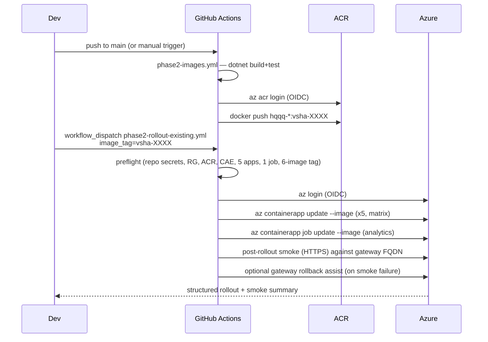

# Phase 2 — Azure deploy walkthrough

This is the **Phase 2 Azure Container Apps surface** listed in the
root [`README.md`](../../README.md) "Current deployment surfaces"
section. It is distinct from the Phase 1 reference demo (the public
live demo links in the README still point at the legacy
`hqqq-api` Web App on Azure App Service, not at this Container Apps
deployment).

Operator-facing companion to
[`infra/azure/README.md`](../../infra/azure/README.md). The README
explains *what* gets provisioned and *how to bootstrap* it; this
document explains *how to use* the resulting workflows day-to-day.

---

## 0) Operating model (current default: manual-resource rollout)

Two distinct Azure deploy paths coexist in this repo. Pick one per
environment and stay on it — they target different resource-naming
conventions and different GitHub Environments.

| Aspect | Rollout-into-existing (default) | Bicep provisioning (legacy) |
|---|---|---|
| Workflow | [`phase2-rollout-existing.yml`](../../.github/workflows/phase2-rollout-existing.yml) | [`phase2-deploy.yml`](../../.github/workflows/phase2-deploy.yml) |
| GitHub Environment | `phase2` | `phase2-demo` |
| Who creates Azure resources | Operator, manually in the portal | Workflow, via Bicep |
| Resource group | `rg-hqqq-p2` | `rg-hqqq-p2-demo-eus-01` |
| ACR | `acrhqqqp2` | `acrhqqqp2demo01` |
| Container Apps env | `cae-hqqq-p2` | `cae-hqqq-p2-demo-eus-01` |
| Redis / Postgres / Event Hubs | Manually provisioned once; settings wired on the Container Apps directly | `data.bicep` provisions and wires them |
| What the workflow does | `az containerapp update --image ...` on pre-existing apps + `az containerapp job update --image ...` on the pre-existing job | `az deployment group create` over `main.bicep` (and optionally `data.bicep`) |
| App-level secrets (`Kafka__*`, `Redis__*`, `Timescale__*`, `Tiingo__*`) | On the Azure Container App config — set once in the portal, rotated in the portal | GitHub environment secrets → Bicep `@secure()` params → Container App `secrets` |
| Idempotent re-run with same `image_tag` | Yes (same image → Container Apps suppresses the new revision) | Yes (Bicep what-if → no-op) |

This document describes the **rollout-into-existing** path as the
default. The Bicep-provisioning path is retained for reference and
for environments that still want IaC-driven resource creation; its
specifics stay in §11 and in the workflow itself. Do **not** run
both workflows against the same resource group.

> **Preflight contract — read this before triggering the rollout
> workflow for the first time.** If these exact 5 Container Apps + 1
> Container Apps Job do not already exist in `rg-hqqq-p2`,
> [`phase2-rollout-existing.yml`](../../.github/workflows/phase2-rollout-existing.yml)'s
> preflight job fails with one aggregated error and rolls out
> nothing:
>
> - `ca-hqqq-p2-gateway`
> - `ca-hqqq-p2-refdata`
> - `ca-hqqq-p2-ingress`
> - `ca-hqqq-p2-quote-engine`
> - `ca-hqqq-p2-persist`
> - `caj-hqqq-p2-analytics`
>
> The same fail-fast applies to `acrhqqqp2`, `cae-hqqq-p2`, and to
> the requested `image_tag` being present in ACR for all six Phase 2
> images (`hqqq-gateway`, `hqqq-reference-data`, `hqqq-ingress`,
> `hqqq-quote-engine`, `hqqq-persistence`, `hqqq-analytics`). The
> full bring-up checklist is §3a-bis.

### 0.2) Hybrid vs Standalone operating mode

Phase 2 runs in one of two operating modes, selected by the
`HQQQ_OPERATING_MODE` env var (canonical hierarchical key:
`OperatingMode`). The mode flows into every Container App as an env
var (Bicep param `operatingMode`, also set in
`docker-compose.phase2.yml`) so the entire deployment swaps modes
together.

| Aspect | `hybrid` (default) | `standalone` |
|---|---|---|
| `hqqq-ingress` | Stub. `Tiingo__ApiKey` is logged-then-ignored if set. The legacy `hqqq-api` monolith bridges live ticks. | Real Tiingo IEX websocket consumer. Publishes `market.raw_ticks.v1` and `market.latest_by_symbol.v1`. Fails fast at startup if `Tiingo__ApiKey` is missing/placeholder. |
| `hqqq-reference-data` | In-memory stub repository. Monolith owns issuer feeds + corp-actions. | Loads a deterministic basket seed (embedded JSON, ~25 N100 names) and publishes a fully-materialized `BasketActiveStateV1` to `refdata.basket.active.v1` on startup with a slow re-publish. Fails fast at startup if the seed is missing/invalid. |
| Quote engine input | Reads ticks + active basket bridged from the monolith via Kafka. | Reads ticks + active basket produced natively by `hqqq-ingress` and `hqqq-reference-data`. |
| External coupling | Requires the legacy `hqqq-api` monolith to be running and pumping Kafka. | Self-contained on Azure — the monolith is not in the path. |
| `/api/system/health` rollup | `ingress` and `refdata` are treated as advisory; their Idle/Unknown state does not drag the gateway to Degraded. | `ingress` and `refdata` are required dependencies; an Idle/Unknown/Degraded child degrades the rollup so smoke catches a broken native component. |
| Smoke tightness | Local: `phase2-smoke.{ps1,sh}`. Azure: `phase2-azure-smoke.sh`. Both assert reachability + 200s. | Same scripts with `-Mode standalone` / `--mode standalone`. They additionally poll `/api/quote` until `nav > 0` and `/api/constituents` until `holdings` is non-empty (warmup window, default 60s, override via `HQQQ_SMOKE_WARMUP_SECONDS`). |
| Pick when | You're demoing the Phase 2 surface alongside the legacy monolith for parity, or you don't yet have Tiingo creds + Kafka egress allowed in the target subscription. | The Phase 2 deployment must run on its own (interview demo, isolated environment, hybrid retired). |

Switching modes is a config-only change — no image rebuild required.
Set `HQQQ_OPERATING_MODE=standalone` (or pass `operatingMode=standalone`
to the Bicep deploy / set the env var on each Container App) and roll
the revision. In `standalone` you must also set `Tiingo__ApiKey` on
the `hqqq-ingress` Container App; everything else has a sensible
default.

### 0.1) Target Azure resource names (manual-resource model)

The rollout workflow's defaults match these names. Override via
repo variables only if you deviate:

| Resource | Default name |
|---|---|
| Resource group | `rg-hqqq-p2` |
| Container Registry | `acrhqqqp2` |
| Container Apps environment | `cae-hqqq-p2` |
| Container App (gateway) | `ca-hqqq-p2-gateway` |
| Container App (reference-data) | `ca-hqqq-p2-refdata` |
| Container App (ingress) | `ca-hqqq-p2-ingress` |
| Container App (quote-engine) | `ca-hqqq-p2-quote-engine` |
| Container App (persistence) | `ca-hqqq-p2-persist` |
| Container Apps Job (analytics) | `caj-hqqq-p2-analytics` |
| Managed Redis | `redis-hqqq-p2` |
| PostgreSQL Flexible Server | `psql-hqqq-p2` |
| Event Hubs namespace | `evh-hqqq-p2` |
| Static Web App | `swa-hqqq-p2` |

---

## 1) Posture

- **Target**: Azure Container Apps + Azure Container Registry.
- **Out of scope**: AKS / Helm / any Kubernetes manifests.
- **Auth**: GitHub OIDC for both image push and app updates. No
  long-lived ACR admin credentials, no publish profiles. (The
  legacy [`hqqq-api-docker.yml`](../../.github/workflows/hqqq-api-docker.yml)
  workflow keeps using `ACR_USERNAME` / `ACR_PASSWORD` against
  the legacy ACR — intentionally left alone so Phase 1 stays
  demoable while Phase 2 hardens.)
- **External dependencies**: Kafka (Event Hubs), Redis, TimescaleDB
  (PostgreSQL Flexible Server with the TimescaleDB extension).
  The rollout-into-existing path expects these to have been
  provisioned manually in the portal and wired into each Container
  App's configuration once; the rollout workflow then only changes
  image tags and does not touch connection strings. The legacy
  Bicep provisioning path (§11) is still available for environments
  that want IaC to stand everything up from scratch.

---

## 2) Standard workflow loop (rollout-into-existing)



---

## 3) Deploying a new revision (rollout-into-existing)

1. Merge code to `main` (or run `phase2-images.yml` manually).
2. Wait for `phase2-images.yml` to push tagged images. Note the
   `vsha-...` tag from the run summary, e.g. `vsha-abcdef0`.
3. Run `phase2-rollout-existing.yml` with `image_tag=vsha-abcdef0`.
   Optional inputs:
   - `services` — CSV subset when only some apps need to roll
     (defaults to `all`).
   - `update_analytics_job` — defaults to `true`.
   - `skip_smoke` — defaults to `false`.
   - `rollback_on_smoke_failure` — defaults to `false`; flip to
     `true` to auto-fall-back to the prior gateway revision on
     smoke failure.
4. Read the run summary for the gateway URL and the per-app new
   revision names.

The rollout is *idempotent*: running with the same `image_tag`
twice is a no-op (Container Apps suppresses a new revision when
the image digest is unchanged and no other template field
changed).

### 3a) First-deploy sequence (manual-resource model)

This is the one-time bootstrap when `rg-hqqq-p2` is freshly
created. Every step is in the Azure portal (or `az` CLI) unless
stated otherwise:

1. **Create the resource group.**
   `az group create --name rg-hqqq-p2 --location <region>`.
2. **Create the ACR** `acrhqqqp2` (Standard SKU is fine),
   `adminUserEnabled=false` (OIDC only).
3. **Create the dependency resources:** Managed Redis
   (`redis-hqqq-p2`), PostgreSQL Flexible Server (`psql-hqqq-p2`)
   with the TimescaleDB extension allow-listed and a `hqqq`
   database, Event Hubs namespace (`evh-hqqq-p2`) with the six
   topics listed in [`topics.md`](topics.md), and (for the UI)
   Static Web App (`swa-hqqq-p2`). If you prefer IaC for this
   step, a one-shot run of the legacy `phase2-deploy.yml` with
   `provision_data_tier=true` against a separate RG is still
   valid — then import the resulting resources into the portal
   conventions. See §11.
4. **Create the Container Apps environment** `cae-hqqq-p2` in the
   same RG. Attach it to your preferred Log Analytics workspace.
5. **Create the five Container Apps** in `cae-hqqq-p2` with
   placeholder images (e.g.
   `mcr.microsoft.com/k8se/quickstart:latest` for dashboards —
   they will be overwritten on the first rollout):
   - `ca-hqqq-p2-gateway` (external ingress on :8080)
   - `ca-hqqq-p2-refdata` (internal ingress, :8080)
   - `ca-hqqq-p2-ingress` (no ingress)
   - `ca-hqqq-p2-quote-engine` (internal ingress, :8080)
   - `ca-hqqq-p2-persist` (no ingress)

   Attach a user-assigned managed identity (UAMI) to each, grant
   the UAMI `AcrPull` on `acrhqqqp2`, and set each app's registry
   configuration to pull from `acrhqqqp2.azurecr.io` using that
   UAMI.
6. **Create the analytics Container Apps Job**
   `caj-hqqq-p2-analytics` in the same env, `triggerType=Manual`,
   `parallelism=1`, `replicaCompletionCount=1`,
   `replicaTimeout=1800`, same UAMI/ACR config as the apps.
7. **Wire app-level settings and secrets on each Container App**
   (portal → Settings → Secrets / Containers). Never set these in
   GitHub — this workflow does not rotate them:
   - `Kafka__BootstrapServers`, `Kafka__SecurityProtocol`,
     `Kafka__SaslMechanism`, `Kafka__SaslUsername`,
     `Kafka__SaslPassword` (on reference-data, ingress,
     quote-engine, persistence)
   - `Redis__Configuration` (on gateway, quote-engine)
   - `Timescale__ConnectionString` (on persistence, analytics)
   - `Tiingo__ApiKey` (on ingress, optional)
   - `Analytics__Mode` and related knobs (on the analytics job)
8. **Grant the GitHub OIDC federated app role access on
   `rg-hqqq-p2`**: `Container Apps Contributor` (or `Contributor`
   if you want a single RBAC), plus `AcrPush` on `acrhqqqp2` so
   `phase2-images.yml` can push.
9. **Configure the GitHub Environment `phase2`** and the repo
   variables / secrets listed in §8a. No environment secrets are
   required for the rollout workflow.
10. **Run `phase2-images.yml`** on the target commit. Note the
    resulting `vsha-...` tag.
11. **Run `phase2-rollout-existing.yml`** with that tag. Preflight
    will fail fast (with an aggregated list) if any of the
    resources from steps 1–6 are still missing.
12. **First-time Timescale extension creation** (one-off, per
    database): run
    `CREATE EXTENSION IF NOT EXISTS timescaledb;` against
    `psql-hqqq-p2` before relying on persistence schema
    bootstrap. Same one-off as the Bicep path (§11).

After this, every subsequent release is just steps 10 + 11.

### 3a-bis) First manual Azure bring-up checklist

Copy-paste pre-flight gate. The rollout workflow's preflight job
will fail fast (with one aggregated error) if **any** of the
boxes below are unchecked when you trigger the first run. Detail
for each item is in §3a; this list exists so an operator can scan
"have I done it?" in one screen before touching GitHub.

**Required Azure infra (created manually in the portal):**

- [ ] Resource group `rg-hqqq-p2`.
- [ ] Container Registry `acrhqqqp2` (`adminUserEnabled=false`,
  OIDC only).
- [ ] Container Apps environment `cae-hqqq-p2` (Log Analytics
  workspace attached).
- [ ] Managed Redis `redis-hqqq-p2`.
- [ ] PostgreSQL Flexible Server `psql-hqqq-p2` with the
  TimescaleDB extension allow-listed and a `hqqq` database.
- [ ] Event Hubs namespace `evh-hqqq-p2` with the six topics from
  [`topics.md`](topics.md).
- [ ] Static Web App `swa-hqqq-p2` (for the `hqqq-ui` frontend).

**The 5 Container Apps in `cae-hqqq-p2` (placeholder image OK):**

- [ ] `ca-hqqq-p2-gateway` — external ingress on :8080.
- [ ] `ca-hqqq-p2-refdata` — internal ingress, :8080.
- [ ] `ca-hqqq-p2-ingress` — no ingress.
- [ ] `ca-hqqq-p2-quote-engine` — internal ingress, :8080.
- [ ] `ca-hqqq-p2-persist` — no ingress.

**The 1 Container Apps Job in `cae-hqqq-p2`:**

- [ ] `caj-hqqq-p2-analytics` — `triggerType=Manual`,
  `parallelism=1`, `replicaCompletionCount=1`,
  `replicaTimeout=1800`.

**Per-app wiring (each of the 5 apps + the job):**

- [ ] User-assigned managed identity attached.
- [ ] UAMI granted `AcrPull` on `acrhqqqp2`.
- [ ] Registry config set to pull from `acrhqqqp2.azurecr.io`
  using that UAMI.
- [ ] App-level secrets set on the Container App config
  (`Kafka__*`, `Redis__*`, `Timescale__*`, optional
  `Tiingo__*` on `ca-hqqq-p2-ingress`,
  `Analytics__Mode` knobs on `caj-hqqq-p2-analytics`).
  These are **never** plumbed through the rollout workflow.

**GitHub Actions auth + config:**

- [ ] OIDC federated app registration has `AcrPush` on
  `acrhqqqp2` and `Container Apps Contributor` (or broader)
  on `rg-hqqq-p2`.
- [ ] Repository **secrets** present and non-empty:
  `AZURE_CLIENT_ID`, `AZURE_TENANT_ID`,
  `AZURE_SUBSCRIPTION_ID`.
- [ ] Repository **variable** `VITE_API_BASE_URL` set to the
  gateway FQDN (`https://<ca-hqqq-p2-gateway-fqdn>`) — required
  by the SWA workflow on `push` to `main` (see §8b).
- [ ] GitHub Environment `phase2` exists (optional reviewers).
  No environment-scoped secrets are required by the rollout
  workflow.
- [ ] Repository variables in §8a.1 left at default unless your
  portal naming deviates.

Once every box is checked, run `phase2-images.yml` on the target
commit, then `phase2-rollout-existing.yml` with the resulting
`vsha-...` tag.

---

## 4) Running analytics on demand

The analytics job is a `Microsoft.App/jobs` resource with
`triggerType=Manual`. It does not auto-run. To execute a one-shot
report over a specific window:

```bash
RG=rg-hqqq-p2
JOB=caj-hqqq-p2-analytics

az containerapp job start \
  --name $JOB \
  --resource-group $RG \
  --env-vars \
    Analytics__StartUtc=2026-04-17T00:00:00Z \
    Analytics__EndUtc=2026-04-18T00:00:00Z

# Tail the most recent execution
EXEC=$(az containerapp job execution list -n $JOB -g $RG --query '[0].name' -o tsv)
az containerapp job logs show -n $JOB -g $RG --execution $EXEC --container $JOB --follow
```

Posture (set in [`main.bicep`](../../infra/azure/main.bicep)):

- `replicaTimeout` = 1800 s (30 min) — overridable per environment.
- `replicaRetryLimit` = 1.
- `parallelism` = 1, `replicaCompletionCount` = 1.
- Exit codes: `0` success (incl. empty window), `1` failure, `2`
  unsupported `Analytics:Mode`. The job marks the execution failed
  on non-zero exit.

---

## 5) Container hardening summary

| Concern              | Where it lives                                             |
| -------------------- | ---------------------------------------------------------- |
| Explicit image tag   | `imageTag` Bicep param; never empty. Pin to `vsha-...`.    |
| Health probes        | `/healthz/live` + `/healthz/ready` on the targetPort, configured per app in [`modules/containerApp.bicep`](../../infra/azure/modules/containerApp.bicep). |
| Env var validation   | Existing `IValidateOptions` registrations in each service — e.g. `AnalyticsOptionsValidator` fail-fasts on missing window. |
| Resource limits      | Per-app `cpu` / `memory` Bicep params, defaults documented in [`infra/azure/README.md`](../../infra/azure/README.md). |
| No public debug port | Workers use `ingress.external=false`; the only externally-reachable app is the gateway on :8080. The management host on :8081 is internal-only. |
| Image pull           | User-assigned MI + `AcrPull`. ACR `adminUserEnabled=false`. |
| Secrets handling     | `@secure()` Bicep params -> Container App `secrets` -> `secretRef` env vars. Never plaintext on the template body. |

The Phase 2 service Dockerfiles already run as a non-root `app`
user (uid 10001) and use pinned `mcr.microsoft.com/dotnet/aspnet:10.0`
base images — no Dockerfile changes required in D4.

---

## 6) Adding a second environment

> **Manual-resource model (default):** add a second environment by
> repeating the §3a-bis bring-up checklist against a new RG (e.g.
> `rg-hqqq-p2-prod`) with its own ACR / CAE / 5 apps / 1 job, then
> create a matching GitHub Environment (e.g. `phase2-prod`),
> override the `PHASE2_*` repo variables under that environment to
> point at the new resource names, and trigger
> `phase2-rollout-existing.yml` with the environment-scoped runs
> gated by approval reviewers. No template / IaC changes required.

The legacy Bicep-provisioning path supports a parallel parameterized
flow for the same outcome (kept for environments still on
`phase2-deploy.yml`):

1. Copy `infra/azure/params/main.demo.bicepparam` to
   `main.prod.bicepparam` and rename every resource (e.g.
   `acrhqqqp2prod01`, `cae-hqqq-p2-prod-eus-01`, ...).
2. Create the prod RG: `az group create -n rg-hqqq-p2-prod-eus-01 -l eastus`.
3. Add a new federated credential for the new GitHub Environment
   (e.g. `phase2-prod`) and grant Contributor on the new RG.
4. Create GitHub Environment `phase2-prod` with its own connection-string secrets and (optionally) approval reviewers.
5. Run `phase2-deploy.yml` with
   `bicep_param_file=infra/azure/params/main.prod.bicepparam`.

No Bicep template changes required for the legacy flow.

---

## 7) What each workflow validates automatically vs. what stays manual

Two Phase 2 workflows exist; each enforces a different gate. Be
honest about which one is running and what it does not cover.

### 7.1) `phase2-rollout-existing.yml` (default)

**Automated (workflow-enforced):**

- Required GitHub repo secrets are present and non-empty
  (`AZURE_CLIENT_ID` / `AZURE_TENANT_ID` / `AZURE_SUBSCRIPTION_ID`).
- Resource group exists (not created by the workflow).
- ACR exists and is reachable.
- Container Apps environment exists.
- All five target Container Apps exist.
- Analytics Container Apps Job exists.
- Requested `image_tag` is published in ACR for **all six** Phase 2
  images (one aggregated error if any are missing).
- `az containerapp update --image` on each app (matrix, partial-set
  selectable via `services`).
- `az containerapp job update --image` on the analytics job (toggle
  via `update_analytics_job`).
- Post-rollout gateway smoke (same probe script as the legacy path):
  `/healthz/live`, `/healthz/ready`, `/api/system/health` with
  `sourceMode=="aggregated"` assertion, `/api/quote`,
  `/api/constituents`, `/api/history?range=1D` with JSON-shape
  assertion.
- Optional gateway-only revision rollback assist (flip traffic back
  to the pre-rollout revision captured in preflight) when
  `rollback_on_smoke_failure=true`.

**Still manual:**

- Creation and configuration of every Azure resource in §0.1.
- Rotation of app-level secrets (`Kafka__*`, `Redis__*`,
  `Timescale__*`, `Tiingo__*`) on each Container App.
- Analytics job execution (the workflow updates the job image but
  does not start a run; kick a window via `az containerapp job
  start` per §4).
- Custom domain + TLS binding on the gateway external ingress.
- Live SignalR fan-out validation.
- Confirming real data flow (vs. documented cold-start 503s).

### 7.2) `phase2-deploy.yml` (legacy Bicep provisioning)

**Automated (workflow-enforced):**

- Required GitHub repo + environment secrets are present and non-empty.
- Bicep param file exists on disk.
- Resource group exists.
- ACR exists and is reachable.
- Requested `image_tag` is published in ACR for **all six** Phase 2
  images (one aggregated error if any are missing).
- `az bicep build` + `az deployment group what-if` + `az deployment
  group create`.
- Structured deployment summary (deployment name, image tag, RG,
  Container Apps env, gateway app + FQDN, gateway latest revision,
  analytics job).
- Post-deploy gateway smoke (same probe script as the rollout path).
- Optional analytics dry-run over a tight one-hour window (when
  `run_analytics_smoke=true`).
- Optional gateway-only revision rollback assist (when
  `rollback_on_smoke_failure=true`).

**Still manual (after this step):**

- Live SignalR fan-out validation (use `replica-smoke.{ps1,sh}` or any
  minimal SignalR client against `wss://<gatewayFqdn>/hubs/market`).
- Confirming `/api/quote` and `/api/constituents` are returning live
  data (HTTP 200 with non-empty payload), not just the documented cold-start
  `503 quote_unavailable` / `503 constituents_unavailable`.
- External-infra reachability validation (Kafka topics present, Redis
  reachable, TimescaleDB reachable from the Container Apps environment).
- Multi-environment promotion (e.g. demo → prod) — currently a
  bicepparam swap done by hand.
- Custom domain + TLS binding on the gateway external ingress.

**"Safe to demo" =** preflight + deploy + smoke jobs all green on the
target `image_tag`.

**"Safe to promote beyond demo"** still additionally requires the
manual checks above plus a successful analytics dry-run against a
real, populated window.

---

## 8) Event Hubs Kafka — SASL auth (manual-resource model)

In the manual-resource model the five Kafka SASL values live as
**Container App secrets** on each Kafka-touching app (and the
analytics job) directly in the Azure portal. They are configured
once at bring-up time and **`phase2-rollout-existing.yml` does not
rewrite them** — rolling a new `image_tag` preserves the existing
secret references and the existing values.

Apps that receive these env vars: `ca-hqqq-p2-refdata`,
`ca-hqqq-p2-ingress`, `ca-hqqq-p2-quote-engine`,
`ca-hqqq-p2-persist`, plus `caj-hqqq-p2-analytics`. The gateway
(`ca-hqqq-p2-gateway`) is deliberately excluded — it does not
construct a Kafka client.

For each app/job above: portal → Settings → **Secrets** → add five
secrets (kebab-case names below), then portal → **Containers** →
**Edit and deploy** → set the corresponding env var to "Reference a
secret" and pick the matching secret name. The mapping is the same
for every Kafka-touching app:

| Container App secret name (kebab-case) | Container App env var       | Example value (Event Hubs) |
|----------------------------------------|-----------------------------|----------------------------|
| `kafka-bootstrap-servers`              | `Kafka__BootstrapServers`   | `<namespace>.servicebus.windows.net:9093` |
| `kafka-security-protocol`              | `Kafka__SecurityProtocol`   | `SaslSsl` |
| `kafka-sasl-mechanism`                 | `Kafka__SaslMechanism`      | `Plain` |
| `kafka-sasl-username`                  | `Kafka__SaslUsername`       | `$ConnectionString` (literal) |
| `kafka-sasl-password`                  | `Kafka__SaslPassword`       | `Endpoint=sb://<namespace>.servicebus.windows.net/;SharedAccessKeyName=...;SharedAccessKey=...` |

`Kafka__EnableTopicBootstrap=false` is a **non-secret** env var on
the same apps. Set it as a plain env var (not a secret) on each
Kafka-touching Container App and on the analytics job. Pre-create
every topic in [`docs/phase2/topics.md`](topics.md) on the namespace
before triggering the rollout — Event Hubs Kafka does not honour
the Kafka `CreateTopics` admin API, so without explicit topics the
producers/consumers will not surface a friendly error, only metadata
warnings.

**Rotation procedure (manual-resource model):**

1. Portal → Container App → **Secrets** → edit the value of the
   secret you want to rotate (e.g. `kafka-sasl-password`).
2. Container Apps materialises a new revision automatically when
   any referenced secret value changes — no rollout workflow run is
   required.
3. Repeat for every Kafka-touching app + the analytics job that
   shares the secret.

Re-running `phase2-rollout-existing.yml` after a rotation is
**not** needed and does **not** re-write the secret. The rollout
workflow only swaps the image tag; the secret references it sets
up at bring-up time stay attached.

Local `docker-compose.phase2.yml` is unaffected — it stays on
plaintext `kafka:29092` (`Kafka__SecurityProtocol` defaults to empty,
which `KafkaConfigBuilder.ApplySecurity` interprets as "skip
security configuration").

### 8.x) Legacy: Bicep `@secure()` injection of Kafka SASL

> **Legacy / secondary path.** This subsection documents how the
> same five SASL values flow through the Bicep-provisioning workflow
> ([`phase2-deploy.yml`](../../.github/workflows/phase2-deploy.yml)
> against the `phase2-demo` GitHub Environment). It is retained for
> environments that still want IaC-driven secret pipelining; the
> default manual-resource path is §8 above and does not use any of
> the GitHub environment secrets below.

In the legacy Bicep path the four SASL values are passed as
`@secure()` Bicep params from `phase2-deploy.yml` into
[`main.bicep`](../../infra/azure/main.bicep) and surfaced into every
Kafka-touching app via per-secret `secretRef` env vars in
[`modules/containerApp.bicep`](../../infra/azure/modules/containerApp.bicep).

| GitHub environment secret (`phase2-demo`) | Bicep `@secure()` param   | Container App env var       | Example value (Event Hubs) |
|-------------------------------------------|---------------------------|-----------------------------|----------------------------|
| `KAFKA_BOOTSTRAP_SERVERS`                 | `kafkaBootstrapServers`   | `Kafka__BootstrapServers`   | `<namespace>.servicebus.windows.net:9093` |
| `KAFKA_SECURITY_PROTOCOL`                 | `kafkaSecurityProtocol`   | `Kafka__SecurityProtocol`   | `SaslSsl` |
| `KAFKA_SASL_MECHANISM`                    | `kafkaSaslMechanism`      | `Kafka__SaslMechanism`      | `Plain` |
| `KAFKA_SASL_USERNAME`                     | `kafkaSaslUsername`       | `Kafka__SaslUsername`       | `$ConnectionString` (literal) |
| `KAFKA_SASL_PASSWORD`                     | `kafkaSaslPassword`       | `Kafka__SaslPassword`       | `Endpoint=sb://<namespace>.servicebus.windows.net/;SharedAccessKeyName=...;SharedAccessKey=...` |

All five are enforced by the `phase2-deploy.yml` preflight: an empty
or missing value short-circuits the run with an aggregated error
listing every gap. Values are never echoed to logs and are surfaced
to the container only as `secretRef` references against per-secret
Container App secrets (kebab-case names like `kafka-sasl-password`),
so they never appear inline in the Bicep template body or deployment
history.

To rotate any of the SASL values in this legacy path: update the
corresponding secret under GitHub Environments → `phase2-demo`,
then re-run `phase2-deploy.yml` against the current `image_tag`.
Container Apps materialises a new revision when secret values
change.

---

## 8a) Required GitHub Secrets / Variables for Azure deployment

### 8a.1) For `phase2-rollout-existing.yml` (default)

Authoritative list. Anything marked **required** is enforced by
the preflight job — the workflow fails fast (with one aggregated
error) if any are missing or empty.

**Repository secrets (required):**

- `AZURE_CLIENT_ID` — federated credential for OIDC.
- `AZURE_TENANT_ID`
- `AZURE_SUBSCRIPTION_ID`

**GitHub Environment `phase2` secrets: none required.**
The rollout-into-existing workflow does **not** consume any
environment-scoped secret. App-level secrets (`Kafka__*`,
`Redis__*`, `Timescale__*`, `Tiingo__*`) live on the Azure
Container Apps themselves, not in GitHub, and rolling a new image
tag does not rewrite them. The `phase2` GitHub Environment exists
only as an attachment point for optional approval reviewers /
deployment protection rules.

**Repository variables (with workflow-side defaults — set only to
override):**

- `PHASE2_RESOURCE_GROUP` — default `rg-hqqq-p2`.
- `PHASE2_ACR_NAME` — default `acrhqqqp2`.
- `PHASE2_CAE_NAME` — default `cae-hqqq-p2`.
- `PHASE2_GATEWAY_APP` — default `ca-hqqq-p2-gateway`.
- `PHASE2_REFDATA_APP` — default `ca-hqqq-p2-refdata`.
- `PHASE2_INGRESS_APP` — default `ca-hqqq-p2-ingress`.
- `PHASE2_QUOTE_APP` — default `ca-hqqq-p2-quote-engine`.
- `PHASE2_PERSISTENCE_APP` — default `ca-hqqq-p2-persist`.
- `PHASE2_ANALYTICS_JOB` — default `caj-hqqq-p2-analytics`.
- `PHASE2_ENVIRONMENT_NAME` — default `phase2`.

Same repo variables also feed `phase2-images.yml`
(`PHASE2_ACR_NAME` only).

### 8a.2) For `phase2-deploy.yml` (legacy Bicep provisioning)

**Repository secrets (required):**

- `AZURE_CLIENT_ID` — federated credential for OIDC.
- `AZURE_TENANT_ID`
- `AZURE_SUBSCRIPTION_ID`

**Environment `phase2-demo` secrets (required):**

- `KAFKA_BOOTSTRAP_SERVERS`
- `KAFKA_SECURITY_PROTOCOL`
- `KAFKA_SASL_MECHANISM`
- `KAFKA_SASL_USERNAME`
- `KAFKA_SASL_PASSWORD`
- `REDIS_CONFIGURATION`
- `TIMESCALE_CONNECTION_STRING`

**Environment `phase2-demo` secrets (optional):**

- `TIINGO_API_KEY` — only required if `hqqq-ingress` is configured to
  consume the Tiingo IEX feed; defaults to empty.
- `POSTGRES_ADMIN_PASSWORD` — required only when
  `provision_data_tier=true` (one-shot bootstrap).

**Repository variables (with workflow-side defaults):**

- `PHASE2_RESOURCE_GROUP` — default `rg-hqqq-p2-demo-eus-01`.
- `PHASE2_LOCATION` — default `eastus`.
- `PHASE2_ACR_NAME` — default `acrhqqqp2demo01`.

For a second environment (e.g. `phase2-prod`), mirror this list
under that GitHub Environment and pass the corresponding
`bicep_param_file` to the workflow.

---

## 8b) Frontend (Static Web Apps) build-time variables

The `hqqq-ui` SWA workflow
([`.github/workflows/azure-static-web-apps-delightful-dune-08a7a390f.yml`](../../.github/workflows/azure-static-web-apps-delightful-dune-08a7a390f.yml))
builds the React + Vite bundle through Oryx and then uploads it to
Azure Static Web Apps. The frontend's API base URL is inlined into
the bundle at build time, so it must be supplied as a GitHub Actions
variable (not a runtime app setting).

**Variable:**

- Name: `VITE_API_BASE_URL`
- Type: GitHub Actions **repository variable** — set it at
  Repo → Settings → Secrets and variables → Actions → **Variables**
  tab → "New repository variable".
- Value: the FQDN of the Phase 2 gateway you want the built UI to
  call (for example, the `gatewayFqdn` output emitted by the Bicep
  deploy in §3). Include the scheme, e.g. `https://<gateway-fqdn>`.

**How it flows:**

The workflow forwards the variable into the `Azure/static-web-apps-deploy@v1`
step's `env:` block, Oryx exposes it to Vite during `npm run build`,
and Vite statically replaces `import.meta.env.VITE_API_BASE_URL` in
[`src/hqqq-ui/src/lib/api.ts`](../../src/hqqq-ui/src/lib/api.ts).
A "Show frontend build target" step in the workflow logs whether
the variable was set (it logs the length only, not the value, so
the URL never appears in PR diffs).

**Unset behavior:**

If the variable is missing or empty the build still succeeds, the
workflow emits a warning, and the deployed UI falls back to
same-origin requests (`fetch("/api/...")` against the SWA host
itself). This keeps PR previews from forks — where repository
variables may not flow — non-fatal.

**Local development:**

Do **not** set `VITE_API_BASE_URL` locally. With it unset, `BASE_URL`
resolves to `""` and the Vite dev server's proxy in
[`src/hqqq-ui/vite.config.ts`](../../src/hqqq-ui/vite.config.ts)
forwards `/api` and `/hubs` to `http://localhost:5015` unchanged.

**Repointing dev / staging / prod:**

To retarget the deployed UI at a different gateway, change the
`VITE_API_BASE_URL` variable value (or, when a second environment
is added, move it under the matching GitHub Environment and attach
the SWA job to that environment) and re-run the workflow. No
code change is required.

---

## 9) Persistent checkpoint storage for `hqqq-quote-engine`

The Container Apps file system is ephemeral per replica, so a
checkpoint written under `/tmp` is lost on every revision swap or
replica restart. The deploy template has an opt-in Azure Files mount
that promotes the checkpoint to durable storage without changing any
quote-engine code or local-dev behaviour.

> **Manual-resource model (default):** the same outcome is reached
> by creating a `Microsoft.Storage/storageAccounts` (Standard_LRS,
> StorageV2, TLS 1.2+, public blob access disabled) + an Azure Files
> share in the portal once, defining it as a Container Apps
> environment storage on `cae-hqqq-p2`, and adding the matching
> `volumes` / `volumeMounts` entries on `ca-hqqq-p2-quote-engine`
> with `QuoteEngine__CheckpointPath=/mnt/quote-engine/checkpoint.json`.
> The toggle described below is the legacy Bicep-driven equivalent.

The toggle lives in the Bicep param file:

```bicep
// infra/azure/params/main.demo.bicepparam
param quoteEngineCheckpointPersistence = true
param quoteEngineStorageAccountName = 'sthqqqp2demoeus01'   // <=24 chars, lowercase alnum, globally unique
param quoteEngineFileShareName       = 'quote-engine-checkpoint'
param quoteEngineEnvStorageName      = 'quote-engine-storage'
param quoteEngineMountPath           = '/mnt/quote-engine'
param quoteEngineFileShareQuotaGiB   = 100
```

| Mode | What gets provisioned | `QuoteEngine__CheckpointPath` |
|---|---|---|
| `quoteEngineCheckpointPersistence=true` (demo default) | `Microsoft.Storage/storageAccounts` (Standard_LRS, StorageV2, TLS 1.2+, public blob access disabled) + Azure Files share + `Microsoft.App/managedEnvironments/storages` definition + `volumes` / `volumeMounts` on the quote-engine Container App. | `/mnt/quote-engine/checkpoint.json` (durable across revisions/restarts). |
| `quoteEngineCheckpointPersistence=false` | Nothing extra. Backward-compatible with pre-existing demo deploys. | `/tmp/quote-engine/checkpoint.json` (ephemeral, lost on restart). |

How the wiring works:

- The storage modules
  ([`infra/azure/modules/storageAccount.bicep`](../../infra/azure/modules/storageAccount.bicep)
  and [`infra/azure/modules/managedEnvironmentStorage.bicep`](../../infra/azure/modules/managedEnvironmentStorage.bicep))
  are conditional on `quoteEngineCheckpointPersistence`; when the
  flag is `false` they are not deployed at all and a `what-if` against
  an existing `false` deploy is a no-op.
- The storage account key is read inside Bicep via `listKeys()` and
  flows into the Container Apps environment storage definition as a
  `@secure()` value; it never appears as a deploy-workflow secret and
  is never echoed to logs. Rotating the key is a Bicep re-deploy.
- The quote-engine app stays single-replica (`quoteEngineMaxReplicas=1`),
  so there is no concurrent-writer concern on the shared file.
- The quote-engine itself reads the path from
  `QuoteEngine__CheckpointPath` (already env-bound via
  [`QuoteEngineOptions.CheckpointPath`](../../src/services/hqqq-quote-engine/Services/QuoteEngineOptions.cs))
  — no service code change, no Dockerfile change.

Operator decisions:

- **Disable persistence** in any environment by setting
  `quoteEngineCheckpointPersistence = false` in that environment's
  bicepparam file and re-running `phase2-deploy.yml`. The next deploy
  will detach the volume and revert the env var to `/tmp/...`. The
  storage account + share are not auto-deleted (Bicep `complete` mode
  is not used); remove them manually with `az storage account delete`
  if no longer needed.
- **Standing up a second environment** (e.g. `prod`): copy
  `main.demo.bicepparam` and pick a different
  `quoteEngineStorageAccountName` (the storage account name is
  globally unique). Everything else (share name, env storage name,
  mount path) can stay the same — they are scoped to the env / app.
- **Local dev is unaffected**: `dotnet run` keeps using
  `./data/quote-engine/checkpoint.json` from `appsettings.json`, and
  `docker-compose.phase2.yml` keeps using the named volume
  `quote_engine_data` mounted at `/data/quote-engine`.

Cost note: a Standard_LRS storage account with a single
TransactionOptimized 100 GiB SMB file share holding a few-KB JSON
checkpoint is dominated by the per-GiB-month base price (well under
USD 1/month at current public pricing) plus negligible transactions
from the 10-second write cadence. The toggle stays opt-in so forks
that don't want any storage cost can keep the historic posture.

---

## 10) Explicitly deferred (D5 / D6 / Phase 3)

- Custom domain + TLS cert binding on the gateway external ingress.
- **Premium Event Hubs** (i.e., Kafka **log compaction** parity for
  `market.latest_by_symbol.v1` and `refdata.basket.active.v1`).
  `data.bicep` defaults to Standard tier; the two compacted topics
  run with time-based retention only on Standard. Operators who
  need true OSS-Kafka compaction parity can override `eventHubsSku`
  to `Premium` per environment.
- **Postgres / Redis / Event Hubs private endpoints** and VNet
  integration of the Container Apps environment. `data.bicep`
  currently uses public endpoints with `AllowAllAzureServices`
  firewall rules — adequate for the demo, not for production.
- **Key Vault**-backed secret resolution for the connection strings.
  The current pipeline stages Bicep `@secure()` outputs as masked
  GitHub Actions job outputs and forwards them into the app-tier
  deployment. A Key Vault round-trip would let the data-tier deploy
  store every secret at provision time and let the app-tier deploy
  reference them by `keyVaultReference` instead of receiving them
  as parameters.
- **AAD auth** to Postgres + AcrPush for the existing UAMI to data
  resources (today only ACR is granted). Prerequisite for removing
  password auth on Postgres.
- `Kafka__EnableTopicBootstrap` threading through the template (no
  longer needed for Event Hubs since `data.bicep` creates the hubs
  declaratively, but the toggle would matter for self-hosted
  Kafka).
- Scheduled trigger for the analytics job (currently Manual only).
- Dapr / service-mesh wiring inside the Container Apps environment.
- Migrating the legacy `hqqq-api` workflow to OIDC.
- Migrating `hqqq-ui` off Static Web Apps if a unified deployment
  posture is later required.

---

## 11) Bootstrapping a brand-new environment with `data.bicep`

> **Legacy / secondary path.** §§0–10 above are the primary
> deployment story (manual-resource model, `rg-hqqq-p2` /
> `ca-hqqq-p2-*` / `caj-hqqq-p2-analytics`,
> `phase2-rollout-existing.yml`). This section documents the
> historical Bicep-provisioning path against the `*-demo-eus-01`
> naming and the `phase2-demo` GitHub Environment, retained for
> environments that still want IaC-driven resource creation. Do
> **not** mix the two against the same resource group.

This is the one-command path for standing up an HQQQ environment
from scratch — i.e., the operator does **not** already have a
Kafka / Redis / Postgres reachable from the new resource group.

### 11.1 What it provisions

| Resource | Default name (demo) | Default SKU |
|---|---|---|
| Azure Managed Redis cluster + database | `redis-hqqq-p2-demo-eus-01` | `Balanced_B0` (smallest GA Managed Redis) |
| PostgreSQL Flexible Server + `hqqq` database | `psql-hqqq-p2-demo-eus-01` | `Standard_B1ms` Burstable, 32 GiB |
| Event Hubs namespace + 6 hubs + Send,Listen SAS rule | `evhns-hqqq-p2-demo-eus-01` | `Standard`, 1 throughput unit |

Topics provisioned (matches `docs/phase2/topics.md` exactly):
`market.raw_ticks.v1` (3 partitions), `market.latest_by_symbol.v1`
(3), `refdata.basket.active.v1` (1), `refdata.basket.events.v1`
(1), `pricing.snapshots.v1` (1), `ops.incidents.v1` (1).

Every SKU/capacity is a parameter — see
[`infra/azure/params/data.demo.bicepparam`](../../infra/azure/params/data.demo.bicepparam)
and [`data.example.bicepparam`](../../infra/azure/params/data.example.bicepparam).

### 11.2 Pre-flight (one-time, per environment)

1. Resource group exists:
   ```bash
   az group create --name rg-hqqq-p2-demo-eus-01 --location eastus
   ```
2. The OIDC federated identity (per
   [`infra/azure/README.md`](../../infra/azure/README.md) §3.2)
   has Contributor on the RG.
3. GitHub environment `phase2-demo` has secret
   `POSTGRES_ADMIN_PASSWORD` set to a value that satisfies Azure's
   Postgres complexity rules (8–128 chars, 3 of {upper, lower,
   digits, symbols}). When `provision_data_tier=true` the workflow
   does **not** require any of `KAFKA_*`, `REDIS_CONFIGURATION`,
   `TIMESCALE_CONNECTION_STRING` — those will be produced by the
   data-tier deployment and forwarded to the app tier as masked
   job outputs.

### 11.3 Run

Trigger `phase2-deploy.yml` manually with:

- `image_tag` = your `vsha-...` tag (must already exist in ACR; if
  the ACR itself does not exist yet, run `phase2-images.yml` first
  with manual ACR creation per `infra/azure/README.md` §3.4).
- `provision_data_tier` = **true**
- `data_bicep_param_file` = `infra/azure/params/data.demo.bicepparam`
  (or your fork)
- Everything else at defaults.

Pipeline shape this run:

```
preflight  →  provision-data  →  deploy  →  smoke
```

The `provision-data` job runs `data.bicep`, captures every
connection string as a **masked** job output, and the `deploy` job
forwards those outputs into `main.bicep`'s `@secure()` parameters
instead of reading from `phase2-demo` env secrets.

### 11.4 Manual post-provision steps

These remain **operator-driven by design** (the IaC contract is
"do not auto-run destructive DB initialization without explicit
control"):

1. **Enable the TimescaleDB extension on the new database.** The
   `data.bicep` template allow-lists `TIMESCALEDB` at the server
   level via the `azure.extensions` server parameter, but it does
   not run `CREATE EXTENSION` itself. Run once per environment:

   ```bash
   PGPASSWORD='<value of POSTGRES_ADMIN_PASSWORD>' psql \
     --host=psql-hqqq-p2-demo-eus-01.postgres.database.azure.com \
     --port=5432 \
     --username=hqqqadmin \
     --dbname=hqqq \
     --command='CREATE EXTENSION IF NOT EXISTS timescaledb;'
   ```

   The exact host / username / database to use are echoed in the
   `Phase 2 data tier: provisioned` summary block of the
   `provision-data` job for copy-paste.

2. **Run the existing Phase 2 schema bootstrap** (unchanged from
   the bring-your-own path) once the extension exists. See
   `docs/runbook.md` for the schema-bootstrap commands the
   `hqqq-persistence` service expects on first run.

3. **Allow your workstation IP** through the Postgres firewall if
   you intend to run `psql` from outside Azure. Two equivalent
   ways:
   - Append a rule to `postgresFirewallAllowedIpRanges` in
     `data.demo.bicepparam` and re-run with
     `provision_data_tier=true` (idempotent).
   - One-off: `az postgres flexible-server firewall-rule create
     --resource-group $RG --name <server> --rule-name
     OperatorOneOff --start-ip-address <ip> --end-ip-address <ip>`.

### 11.5 Re-running and idempotency

- `provision_data_tier=true` is idempotent. Re-running with the
  same param file is a no-op except where `azure.extensions` or
  firewall rules changed; Bicep what-if previews any drift.
- Once the data tier is up, **do not** keep `provision_data_tier=true`
  for routine app-tier redeploys — set it back to `false` and the
  workflow takes the historic env-secret pathway. To avoid having
  to also paste connection strings into `phase2-demo` secrets at
  that point, run a one-off `gh secret set` populated from the
  data-tier deployment outputs (a Key Vault round-trip is the
  recommended D5 cleanup; see §10).

### 11.6 Cost note (smallest dev SKUs)

The defaults above are roughly **USD 60–80/month** at current
public list pricing for the data tier alone (Managed Redis
`Balanced_B0` ≈ $40, Postgres `Standard_B1ms` ≈ $13 + storage,
Event Hubs Standard 1 TU ≈ $11). Standby / HA is off, geo-redundant
backup is off, and Event Hubs auto-inflate is off, so the bill is
predictable. Override per environment via
`data.<env>.bicepparam` when prod sizing is needed.

---

## 12) Migrating from `phase2-deploy.yml` to `phase2-rollout-existing.yml`

This section exists for operators who historically drove Phase 2
through the Bicep provisioning workflow and are switching to the
manual-resource operating model documented in §0.

### 12.1 Workflow mapping

| Old (`phase2-deploy.yml`) | New (`phase2-rollout-existing.yml`) |
|---|---|
| `preflight` (secrets, RG, ACR, 6-image) | `preflight` (repo secrets, RG, ACR, CAE, 5 apps, 1 job, 6-image) |
| `provision-data` (data.bicep) | n/a — manually provision Redis / Postgres / Event Hubs in the portal once |
| `deploy` (`az deployment group create` over `main.bicep`) | `rollout` matrix (`az containerapp update --image`, 5 apps) + `rollout-job` (`az containerapp job update --image`, 1 job) |
| `smoke` (reuses `infra/azure/scripts/phase2-azure-smoke.sh`) | `smoke` (**same** script, reused verbatim) |
| `rollback-assist` (pick "most recent other" revision) | `rollback-assist` (flip to the pre-rollout revision captured in preflight — deterministic) |

### 12.2 One-time GitHub configuration

1. Create a new GitHub Environment named `phase2` (Repo →
   Settings → Environments → New environment). Add optional
   reviewers if you want approval gating on rollouts; no
   environment secrets are required.
2. Make sure repo secrets `AZURE_CLIENT_ID`, `AZURE_TENANT_ID`,
   `AZURE_SUBSCRIPTION_ID` already exist (they are shared with
   the legacy workflow).
3. Override the resource-name repo variables from §8a.1 only if
   your portal naming does not match the defaults.
4. Grant the OIDC federated app registration `AcrPush` on
   `acrhqqqp2` and `Container Apps Contributor` (or
   `Contributor`) on `rg-hqqq-p2`. The legacy app registration
   scoped to `rg-hqqq-p2-demo-eus-01` keeps working in parallel
   — nothing to revoke.

### 12.3 First rollout against existing resources

1. Run `phase2-images.yml` on the target commit and note the
   `vsha-...` tag.
2. Run `phase2-rollout-existing.yml` with that tag. Preflight
   will fail fast with an aggregated list if any resource is
   still missing or misnamed — fix in the portal, re-run.
3. On green smoke, the rollout is complete. The gateway FQDN,
   per-app new revision names, and the analytics job image are
   all printed in the run summary.

### 12.4 Coexistence

Both workflows can stay in the repo indefinitely; they target
different RGs / ACRs / GitHub Environments and will not conflict.
Pick one per environment:

- New environments and the documented Phase 2 surface —
  `phase2-rollout-existing.yml` against `rg-hqqq-p2`.
- Any remaining `*-demo-*` environment still using IaC —
  `phase2-deploy.yml` against `rg-hqqq-p2-demo-eus-01`.

The `phase2-demo` GitHub Environment and its secrets can remain
untouched; they are not required by the new workflow.
