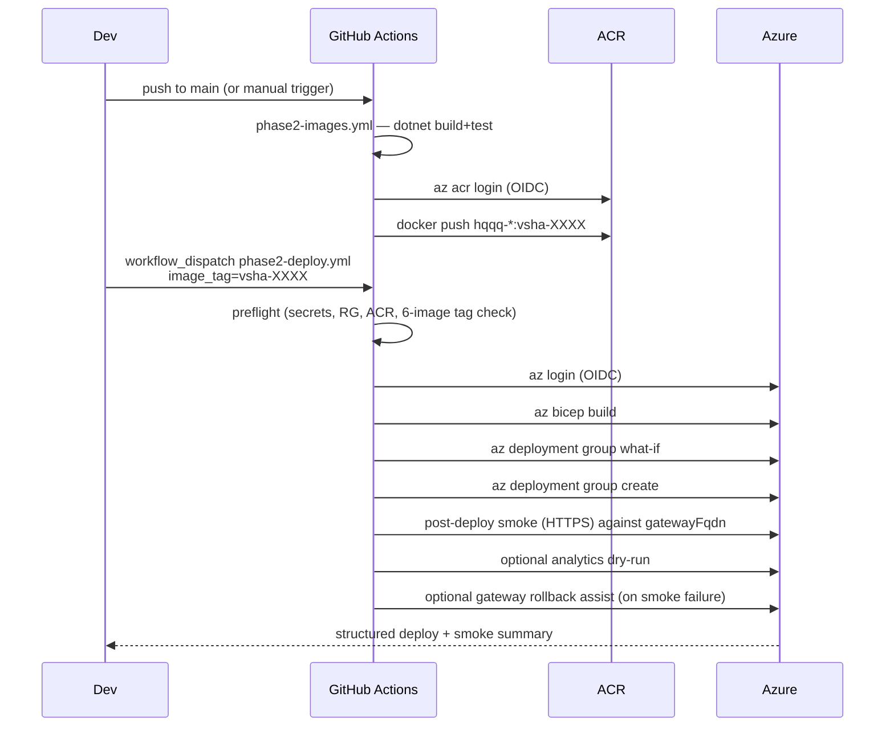

# Phase 2 — Azure deploy walkthrough

This is the **Phase 2 Azure Container Apps surface** listed in the
root [`README.md`](../../README.md) "Current deployment surfaces"
section. It is distinct from the Phase 1 reference demo (the public
live demo links in the README still point at the legacy
`hqqq-api` Web App on Azure App Service, not at this Container Apps
deployment).

Operator-facing companion to
[`infra/azure/README.md`](../../infra/azure/README.md). The README
explains *what* gets provisioned and *how to bootstrap* it; this
document explains *how to use* the resulting workflows day-to-day.

---

## 1) Posture

- **Target**: Azure Container Apps + Azure Container Registry.
- **Out of scope**: AKS / Helm / any Kubernetes manifests.
- **Auth**: GitHub OIDC for both image push and Bicep deploy. No
  long-lived ACR admin credentials in the Phase 2 path. (The
  legacy [`hqqq-api-docker.yml`](../../.github/workflows/hqqq-api-docker.yml)
  workflow keeps using `ACR_USERNAME` / `ACR_PASSWORD` against
  the legacy ACR — intentionally left alone so Phase 1 stays
  demoable while Phase 2 hardens.)
- **External dependencies**: Kafka, Redis, TimescaleDB. Their
  connection strings reach the Container Apps environment as
  deploy-time secrets. Two provisioning paths are supported:
  (a) **bring-your-own** — point the workflow at any reachable
  Kafka / Redis / Postgres and supply connection strings via
  `phase2-demo` GitHub environment secrets (the historic posture);
  (b) **bootstrap from Bicep** — set `provision_data_tier=true`
  and the workflow first runs [`infra/azure/data.bicep`](../../infra/azure/data.bicep)
  to provision Azure Managed Redis, Azure Database for PostgreSQL
  Flexible Server (with the TimescaleDB extension allow-listed),
  and an Event Hubs namespace + the six HQQQ topics — then pipes
  the resulting connection strings into the app tier. See §11.

---

## 2) Standard workflow loop



---

## 3) Deploying a new revision

1. Merge code to `main` (or run `phase2-images.yml` manually).
2. Wait for `phase2-images.yml` to push tagged images. Note the
   `vsha-...` tag from the run summary, e.g. `vsha-abcdef0`.
3. Run `phase2-deploy.yml` with `image_tag=vsha-abcdef0`. Optional:
   set `what_if_only=true` first for a dry run.
4. Read the run summary for the gateway URL and the smoke
   commands.

The deploy is *idempotent*: running with the same `image_tag`
twice is a no-op for the images, and Bicep only re-applies what
changed. Container Apps creates a new revision when env vars or
the image change.

---

## 4) Running analytics on demand

The analytics job is a `Microsoft.App/jobs` resource with
`triggerType=Manual`. It does not auto-run. To execute a one-shot
report over a specific window:

```bash
RG=rg-hqqq-p2-demo-eus-01
JOB=caj-hqqq-p2-analytics-demo-01

az containerapp job start \
  --name $JOB \
  --resource-group $RG \
  --env-vars \
    Analytics__StartUtc=2026-04-17T00:00:00Z \
    Analytics__EndUtc=2026-04-18T00:00:00Z

# Tail the most recent execution
EXEC=$(az containerapp job execution list -n $JOB -g $RG --query '[0].name' -o tsv)
az containerapp job logs show -n $JOB -g $RG --execution $EXEC --container $JOB --follow
```

Posture (set in [`main.bicep`](../../infra/azure/main.bicep)):

- `replicaTimeout` = 1800 s (30 min) — overridable per environment.
- `replicaRetryLimit` = 1.
- `parallelism` = 1, `replicaCompletionCount` = 1.
- Exit codes: `0` success (incl. empty window), `1` failure, `2`
  unsupported `Analytics:Mode`. The job marks the execution failed
  on non-zero exit.

---

## 5) Container hardening summary

| Concern              | Where it lives                                             |
| -------------------- | ---------------------------------------------------------- |
| Explicit image tag   | `imageTag` Bicep param; never empty. Pin to `vsha-...`.    |
| Health probes        | `/healthz/live` + `/healthz/ready` on the targetPort, configured per app in [`modules/containerApp.bicep`](../../infra/azure/modules/containerApp.bicep). |
| Env var validation   | Existing `IValidateOptions` registrations in each service — e.g. `AnalyticsOptionsValidator` fail-fasts on missing window. |
| Resource limits      | Per-app `cpu` / `memory` Bicep params, defaults documented in [`infra/azure/README.md`](../../infra/azure/README.md). |
| No public debug port | Workers use `ingress.external=false`; the only externally-reachable app is the gateway on :8080. The management host on :8081 is internal-only. |
| Image pull           | User-assigned MI + `AcrPull`. ACR `adminUserEnabled=false`. |
| Secrets handling     | `@secure()` Bicep params -> Container App `secrets` -> `secretRef` env vars. Never plaintext on the template body. |

The Phase 2 service Dockerfiles already run as a non-root `app`
user (uid 10001) and use pinned `mcr.microsoft.com/dotnet/aspnet:10.0`
base images — no Dockerfile changes required in D4.

---

## 6) Adding a second environment

Phase 2 IaC is fully parameterized. Adding e.g. a `prod` boundary:

1. Copy `infra/azure/params/main.demo.bicepparam` to
   `main.prod.bicepparam` and rename every resource (e.g.
   `acrhqqqp2prod01`, `cae-hqqq-p2-prod-eus-01`, ...).
2. Create the prod RG: `az group create -n rg-hqqq-p2-prod-eus-01 -l eastus`.
3. Add a new federated credential for the new GitHub Environment
   (e.g. `phase2-prod`) and grant Contributor on the new RG.
4. Create GitHub Environment `phase2-prod` with its own connection-string secrets and (optionally) approval reviewers.
5. Run `phase2-deploy.yml` with
   `bicep_param_file=infra/azure/params/main.prod.bicepparam`.

No Bicep template changes required.

---

## 7) What the workflow validates automatically vs. what stays manual

The `phase2-deploy.yml` pipeline now enforces a release-hardening gate.
Be honest about what it covers and what it does not:

**Automated (workflow-enforced):**

- Required GitHub repo + environment secrets are present and non-empty.
- Bicep param file exists on disk.
- Resource group exists.
- ACR exists and is reachable.
- Requested `image_tag` is published in ACR for **all six** Phase 2
  images (one aggregated error if any are missing).
- `az bicep build` + `az deployment group what-if` + `az deployment
  group create`.
- Structured deployment summary (deployment name, image tag, RG,
  Container Apps env, gateway app + FQDN, gateway latest revision,
  analytics job).
- Post-deploy gateway smoke: `/healthz/live`, `/healthz/ready`,
  `/api/system/health` with `sourceMode=="aggregated"` assertion (so a
  silent fall-back to the legacy/stub adapter is caught), `/api/quote`,
  `/api/constituents`, `/api/history?range=1D` with JSON-shape
  assertion.
- Optional analytics dry-run over a tight one-hour window (when
  `run_analytics_smoke=true`).
- Optional gateway-only revision rollback assist (when
  `rollback_on_smoke_failure=true`).

**Still manual (after this step):**

- Live SignalR fan-out validation (use `replica-smoke.{ps1,sh}` or any
  minimal SignalR client against `wss://<gatewayFqdn>/hubs/market`).
- Confirming `/api/quote` and `/api/constituents` are returning live
  data (HTTP 200 with non-empty payload), not just the documented cold-start
  `503 quote_unavailable` / `503 constituents_unavailable`.
- External-infra reachability validation (Kafka topics present, Redis
  reachable, TimescaleDB reachable from the Container Apps environment).
- Multi-environment promotion (e.g. demo → prod) — currently a
  bicepparam swap done by hand.
- Custom domain + TLS binding on the gateway external ingress.

**"Safe to demo" =** preflight + deploy + smoke jobs all green on the
target `image_tag`.

**"Safe to promote beyond demo"** still additionally requires the
manual checks above plus a successful analytics dry-run against a
real, populated window.

---

## 8) Event Hubs Kafka — workflow-injected SASL auth

Pointing the Phase 2 services at an Azure Event Hubs Kafka namespace
is now a deploy-time concern, not a manual `az containerapp update`
step. The four SASL values are passed as `@secure()` Bicep params
from `phase2-deploy.yml` into [`main.bicep`](../../infra/azure/main.bicep)
and surfaced into every Kafka-touching app via per-secret
`secretRef` env vars in [`modules/containerApp.bicep`](../../infra/azure/modules/containerApp.bicep).

Apps that receive these env vars: `hqqq-reference-data`,
`hqqq-ingress`, `hqqq-quote-engine`, `hqqq-persistence`. Gateway and
analytics are deliberately excluded (no Kafka client usage).

| GitHub environment secret (`phase2-demo`) | Bicep `@secure()` param   | Container App env var       | Example value (Event Hubs) |
|-------------------------------------------|---------------------------|-----------------------------|----------------------------|
| `KAFKA_BOOTSTRAP_SERVERS`                 | `kafkaBootstrapServers`   | `Kafka__BootstrapServers`   | `<namespace>.servicebus.windows.net:9093` |
| `KAFKA_SECURITY_PROTOCOL`                 | `kafkaSecurityProtocol`   | `Kafka__SecurityProtocol`   | `SaslSsl` |
| `KAFKA_SASL_MECHANISM`                    | `kafkaSaslMechanism`      | `Kafka__SaslMechanism`      | `Plain` |
| `KAFKA_SASL_USERNAME`                     | `kafkaSaslUsername`       | `Kafka__SaslUsername`       | `$ConnectionString` (literal) |
| `KAFKA_SASL_PASSWORD`                     | `kafkaSaslPassword`       | `Kafka__SaslPassword`       | `Endpoint=sb://<namespace>.servicebus.windows.net/;SharedAccessKeyName=...;SharedAccessKey=...` |

All five are enforced by the `phase2-deploy.yml` preflight: an empty
or missing value short-circuits the run with an aggregated error
listing every gap. Values are never echoed to logs and are surfaced
to the container only as `secretRef` references against per-secret
Container App secrets (kebab-case names like `kafka-sasl-password`),
so they never appear inline in the Bicep template body or deployment
history.

`Kafka__EnableTopicBootstrap=false` is **not** wired through the
deploy template (it is a non-secret static toggle): set it via
`appsettings.json` / non-secret env override per environment if the
broker rejects topic creation. Pre-create every topic in
[`docs/phase2/topics.md`](topics.md) on the namespace before
deploying — Event Hubs Kafka does not honour the `CreateTopics`
admin API.

To rotate any of the SASL values: update the corresponding secret
under GitHub Environments → `phase2-demo`, then re-run
`phase2-deploy.yml` against the current `image_tag`. Container Apps
materialises a new revision when secret values change.

Local `docker-compose.phase2.yml` is unaffected — it stays on
plaintext `kafka:29092` (`Kafka__SecurityProtocol` defaults to empty,
which `KafkaConfigBuilder.ApplySecurity` interprets as "skip
security configuration").

---

## 8a) Required GitHub Secrets / Variables for Azure deployment

Authoritative list for the `phase2-deploy.yml` workflow. Anything
marked **required** is enforced by the preflight job — the workflow
fails fast (with one aggregated error) if any are missing or empty.

**Repository secrets (required):**

- `AZURE_CLIENT_ID` — federated credential for OIDC.
- `AZURE_TENANT_ID`
- `AZURE_SUBSCRIPTION_ID`

**Environment `phase2-demo` secrets (required):**

- `KAFKA_BOOTSTRAP_SERVERS`
- `KAFKA_SECURITY_PROTOCOL`
- `KAFKA_SASL_MECHANISM`
- `KAFKA_SASL_USERNAME`
- `KAFKA_SASL_PASSWORD`
- `REDIS_CONFIGURATION`
- `TIMESCALE_CONNECTION_STRING`

**Environment `phase2-demo` secrets (optional):**

- `TIINGO_API_KEY` — only required if `hqqq-ingress` is configured to
  consume the Tiingo IEX feed; defaults to empty.

**Repository variables (with workflow-side defaults):**

- `PHASE2_RESOURCE_GROUP` — default `rg-hqqq-p2-demo-eus-01`.
- `PHASE2_LOCATION` — default `eastus`.
- `PHASE2_ACR_NAME` — default `acrhqqqp2demo01`.

For a second environment (e.g. `phase2-prod`), mirror this list
under that GitHub Environment and pass the corresponding
`bicep_param_file` to the workflow.

---

## 8b) Frontend (Static Web Apps) build-time variables

The `hqqq-ui` SWA workflow
([`.github/workflows/azure-static-web-apps-delightful-dune-08a7a390f.yml`](../../.github/workflows/azure-static-web-apps-delightful-dune-08a7a390f.yml))
builds the React + Vite bundle through Oryx and then uploads it to
Azure Static Web Apps. The frontend's API base URL is inlined into
the bundle at build time, so it must be supplied as a GitHub Actions
variable (not a runtime app setting).

**Variable:**

- Name: `VITE_API_BASE_URL`
- Type: GitHub Actions **repository variable** — set it at
  Repo → Settings → Secrets and variables → Actions → **Variables**
  tab → "New repository variable".
- Value: the FQDN of the Phase 2 gateway you want the built UI to
  call (for example, the `gatewayFqdn` output emitted by the Bicep
  deploy in §3). Include the scheme, e.g. `https://<gateway-fqdn>`.

**How it flows:**

The workflow forwards the variable into the `Azure/static-web-apps-deploy@v1`
step's `env:` block, Oryx exposes it to Vite during `npm run build`,
and Vite statically replaces `import.meta.env.VITE_API_BASE_URL` in
[`src/hqqq-ui/src/lib/api.ts`](../../src/hqqq-ui/src/lib/api.ts).
A "Show frontend build target" step in the workflow logs whether
the variable was set (it logs the length only, not the value, so
the URL never appears in PR diffs).

**Unset behavior:**

If the variable is missing or empty the build still succeeds, the
workflow emits a warning, and the deployed UI falls back to
same-origin requests (`fetch("/api/...")` against the SWA host
itself). This keeps PR previews from forks — where repository
variables may not flow — non-fatal.

**Local development:**

Do **not** set `VITE_API_BASE_URL` locally. With it unset, `BASE_URL`
resolves to `""` and the Vite dev server's proxy in
[`src/hqqq-ui/vite.config.ts`](../../src/hqqq-ui/vite.config.ts)
forwards `/api` and `/hubs` to `http://localhost:5015` unchanged.

**Repointing dev / staging / prod:**

To retarget the deployed UI at a different gateway, change the
`VITE_API_BASE_URL` variable value (or, when a second environment
is added, move it under the matching GitHub Environment and attach
the SWA job to that environment) and re-run the workflow. No
code change is required.

---

## 9) Persistent checkpoint storage for `hqqq-quote-engine`

The Container Apps file system is ephemeral per replica, so a
checkpoint written under `/tmp` is lost on every revision swap or
replica restart. The deploy template has an opt-in Azure Files mount
that promotes the checkpoint to durable storage without changing any
quote-engine code or local-dev behaviour.

The toggle lives in the Bicep param file:

```bicep
// infra/azure/params/main.demo.bicepparam
param quoteEngineCheckpointPersistence = true
param quoteEngineStorageAccountName = 'sthqqqp2demoeus01'   // <=24 chars, lowercase alnum, globally unique
param quoteEngineFileShareName       = 'quote-engine-checkpoint'
param quoteEngineEnvStorageName      = 'quote-engine-storage'
param quoteEngineMountPath           = '/mnt/quote-engine'
param quoteEngineFileShareQuotaGiB   = 100
```

| Mode | What gets provisioned | `QuoteEngine__CheckpointPath` |
|---|---|---|
| `quoteEngineCheckpointPersistence=true` (demo default) | `Microsoft.Storage/storageAccounts` (Standard_LRS, StorageV2, TLS 1.2+, public blob access disabled) + Azure Files share + `Microsoft.App/managedEnvironments/storages` definition + `volumes` / `volumeMounts` on the quote-engine Container App. | `/mnt/quote-engine/checkpoint.json` (durable across revisions/restarts). |
| `quoteEngineCheckpointPersistence=false` | Nothing extra. Backward-compatible with pre-existing demo deploys. | `/tmp/quote-engine/checkpoint.json` (ephemeral, lost on restart). |

How the wiring works:

- The storage modules
  ([`infra/azure/modules/storageAccount.bicep`](../../infra/azure/modules/storageAccount.bicep)
  and [`infra/azure/modules/managedEnvironmentStorage.bicep`](../../infra/azure/modules/managedEnvironmentStorage.bicep))
  are conditional on `quoteEngineCheckpointPersistence`; when the
  flag is `false` they are not deployed at all and a `what-if` against
  an existing `false` deploy is a no-op.
- The storage account key is read inside Bicep via `listKeys()` and
  flows into the Container Apps environment storage definition as a
  `@secure()` value; it never appears as a deploy-workflow secret and
  is never echoed to logs. Rotating the key is a Bicep re-deploy.
- The quote-engine app stays single-replica (`quoteEngineMaxReplicas=1`),
  so there is no concurrent-writer concern on the shared file.
- The quote-engine itself reads the path from
  `QuoteEngine__CheckpointPath` (already env-bound via
  [`QuoteEngineOptions.CheckpointPath`](../../src/services/hqqq-quote-engine/Services/QuoteEngineOptions.cs))
  — no service code change, no Dockerfile change.

Operator decisions:

- **Disable persistence** in any environment by setting
  `quoteEngineCheckpointPersistence = false` in that environment's
  bicepparam file and re-running `phase2-deploy.yml`. The next deploy
  will detach the volume and revert the env var to `/tmp/...`. The
  storage account + share are not auto-deleted (Bicep `complete` mode
  is not used); remove them manually with `az storage account delete`
  if no longer needed.
- **Standing up a second environment** (e.g. `prod`): copy
  `main.demo.bicepparam` and pick a different
  `quoteEngineStorageAccountName` (the storage account name is
  globally unique). Everything else (share name, env storage name,
  mount path) can stay the same — they are scoped to the env / app.
- **Local dev is unaffected**: `dotnet run` keeps using
  `./data/quote-engine/checkpoint.json` from `appsettings.json`, and
  `docker-compose.phase2.yml` keeps using the named volume
  `quote_engine_data` mounted at `/data/quote-engine`.

Cost note: a Standard_LRS storage account with a single
TransactionOptimized 100 GiB SMB file share holding a few-KB JSON
checkpoint is dominated by the per-GiB-month base price (well under
USD 1/month at current public pricing) plus negligible transactions
from the 10-second write cadence. The toggle stays opt-in so forks
that don't want any storage cost can keep the historic posture.

---

## 10) Explicitly deferred (D5 / D6 / Phase 3)

- Custom domain + TLS cert binding on the gateway external ingress.
- **Premium Event Hubs** (i.e., Kafka **log compaction** parity for
  `market.latest_by_symbol.v1` and `refdata.basket.active.v1`).
  `data.bicep` defaults to Standard tier; the two compacted topics
  run with time-based retention only on Standard. Operators who
  need true OSS-Kafka compaction parity can override `eventHubsSku`
  to `Premium` per environment.
- **Postgres / Redis / Event Hubs private endpoints** and VNet
  integration of the Container Apps environment. `data.bicep`
  currently uses public endpoints with `AllowAllAzureServices`
  firewall rules — adequate for the demo, not for production.
- **Key Vault**-backed secret resolution for the connection strings.
  The current pipeline stages Bicep `@secure()` outputs as masked
  GitHub Actions job outputs and forwards them into the app-tier
  deployment. A Key Vault round-trip would let the data-tier deploy
  store every secret at provision time and let the app-tier deploy
  reference them by `keyVaultReference` instead of receiving them
  as parameters.
- **AAD auth** to Postgres + AcrPush for the existing UAMI to data
  resources (today only ACR is granted). Prerequisite for removing
  password auth on Postgres.
- `Kafka__EnableTopicBootstrap` threading through the template (no
  longer needed for Event Hubs since `data.bicep` creates the hubs
  declaratively, but the toggle would matter for self-hosted
  Kafka).
- Scheduled trigger for the analytics job (currently Manual only).
- Dapr / service-mesh wiring inside the Container Apps environment.
- Migrating the legacy `hqqq-api` workflow to OIDC.
- Migrating `hqqq-ui` off Static Web Apps if a unified deployment
  posture is later required.

---

## 11) Bootstrapping a brand-new environment with `data.bicep`

This is the one-command path for standing up an HQQQ environment
from scratch — i.e., the operator does **not** already have a
Kafka / Redis / Postgres reachable from the new resource group.

### 11.1 What it provisions

| Resource | Default name (demo) | Default SKU |
|---|---|---|
| Azure Managed Redis cluster + database | `redis-hqqq-p2-demo-eus-01` | `Balanced_B0` (smallest GA Managed Redis) |
| PostgreSQL Flexible Server + `hqqq` database | `psql-hqqq-p2-demo-eus-01` | `Standard_B1ms` Burstable, 32 GiB |
| Event Hubs namespace + 6 hubs + Send,Listen SAS rule | `evhns-hqqq-p2-demo-eus-01` | `Standard`, 1 throughput unit |

Topics provisioned (matches `docs/phase2/topics.md` exactly):
`market.raw_ticks.v1` (3 partitions), `market.latest_by_symbol.v1`
(3), `refdata.basket.active.v1` (1), `refdata.basket.events.v1`
(1), `pricing.snapshots.v1` (1), `ops.incidents.v1` (1).

Every SKU/capacity is a parameter — see
[`infra/azure/params/data.demo.bicepparam`](../../infra/azure/params/data.demo.bicepparam)
and [`data.example.bicepparam`](../../infra/azure/params/data.example.bicepparam).

### 11.2 Pre-flight (one-time, per environment)

1. Resource group exists:
   ```bash
   az group create --name rg-hqqq-p2-demo-eus-01 --location eastus
   ```
2. The OIDC federated identity (per
   [`infra/azure/README.md`](../../infra/azure/README.md) §3.2)
   has Contributor on the RG.
3. GitHub environment `phase2-demo` has secret
   `POSTGRES_ADMIN_PASSWORD` set to a value that satisfies Azure's
   Postgres complexity rules (8–128 chars, 3 of {upper, lower,
   digits, symbols}). When `provision_data_tier=true` the workflow
   does **not** require any of `KAFKA_*`, `REDIS_CONFIGURATION`,
   `TIMESCALE_CONNECTION_STRING` — those will be produced by the
   data-tier deployment and forwarded to the app tier as masked
   job outputs.

### 11.3 Run

Trigger `phase2-deploy.yml` manually with:

- `image_tag` = your `vsha-...` tag (must already exist in ACR; if
  the ACR itself does not exist yet, run `phase2-images.yml` first
  with manual ACR creation per `infra/azure/README.md` §3.4).
- `provision_data_tier` = **true**
- `data_bicep_param_file` = `infra/azure/params/data.demo.bicepparam`
  (or your fork)
- Everything else at defaults.

Pipeline shape this run:

```
preflight  →  provision-data  →  deploy  →  smoke
```

The `provision-data` job runs `data.bicep`, captures every
connection string as a **masked** job output, and the `deploy` job
forwards those outputs into `main.bicep`'s `@secure()` parameters
instead of reading from `phase2-demo` env secrets.

### 11.4 Manual post-provision steps

These remain **operator-driven by design** (the IaC contract is
"do not auto-run destructive DB initialization without explicit
control"):

1. **Enable the TimescaleDB extension on the new database.** The
   `data.bicep` template allow-lists `TIMESCALEDB` at the server
   level via the `azure.extensions` server parameter, but it does
   not run `CREATE EXTENSION` itself. Run once per environment:

   ```bash
   PGPASSWORD='<value of POSTGRES_ADMIN_PASSWORD>' psql \
     --host=psql-hqqq-p2-demo-eus-01.postgres.database.azure.com \
     --port=5432 \
     --username=hqqqadmin \
     --dbname=hqqq \
     --command='CREATE EXTENSION IF NOT EXISTS timescaledb;'
   ```

   The exact host / username / database to use are echoed in the
   `Phase 2 data tier: provisioned` summary block of the
   `provision-data` job for copy-paste.

2. **Run the existing Phase 2 schema bootstrap** (unchanged from
   the bring-your-own path) once the extension exists. See
   `docs/runbook.md` for the schema-bootstrap commands the
   `hqqq-persistence` service expects on first run.

3. **Allow your workstation IP** through the Postgres firewall if
   you intend to run `psql` from outside Azure. Two equivalent
   ways:
   - Append a rule to `postgresFirewallAllowedIpRanges` in
     `data.demo.bicepparam` and re-run with
     `provision_data_tier=true` (idempotent).
   - One-off: `az postgres flexible-server firewall-rule create
     --resource-group $RG --name <server> --rule-name
     OperatorOneOff --start-ip-address <ip> --end-ip-address <ip>`.

### 11.5 Re-running and idempotency

- `provision_data_tier=true` is idempotent. Re-running with the
  same param file is a no-op except where `azure.extensions` or
  firewall rules changed; Bicep what-if previews any drift.
- Once the data tier is up, **do not** keep `provision_data_tier=true`
  for routine app-tier redeploys — set it back to `false` and the
  workflow takes the historic env-secret pathway. To avoid having
  to also paste connection strings into `phase2-demo` secrets at
  that point, run a one-off `gh secret set` populated from the
  data-tier deployment outputs (a Key Vault round-trip is the
  recommended D5 cleanup; see §10).

### 11.6 Cost note (smallest dev SKUs)

The defaults above are roughly **USD 60–80/month** at current
public list pricing for the data tier alone (Managed Redis
`Balanced_B0` ≈ $40, Postgres `Standard_B1ms` ≈ $13 + storage,
Event Hubs Standard 1 TU ≈ $11). Standby / HA is off, geo-redundant
backup is off, and Event Hubs auto-inflate is off, so the bill is
predictable. Override per environment via
`data.<env>.bicepparam` when prod sizing is needed.
